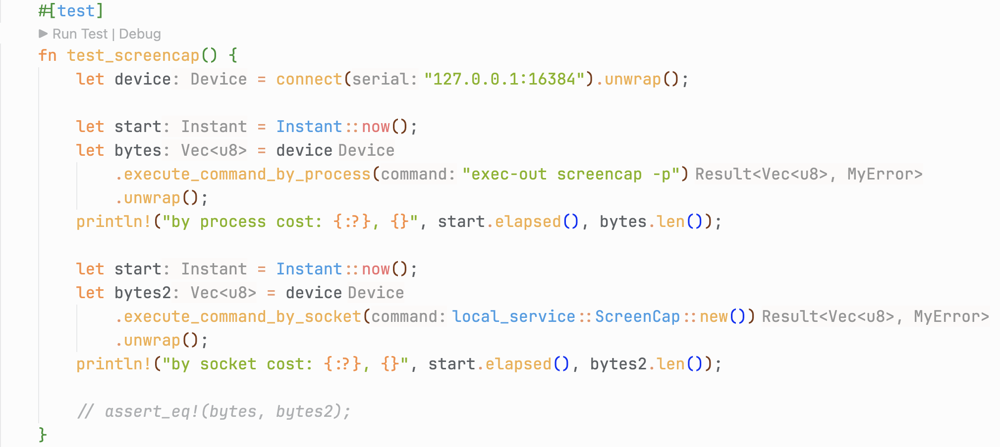
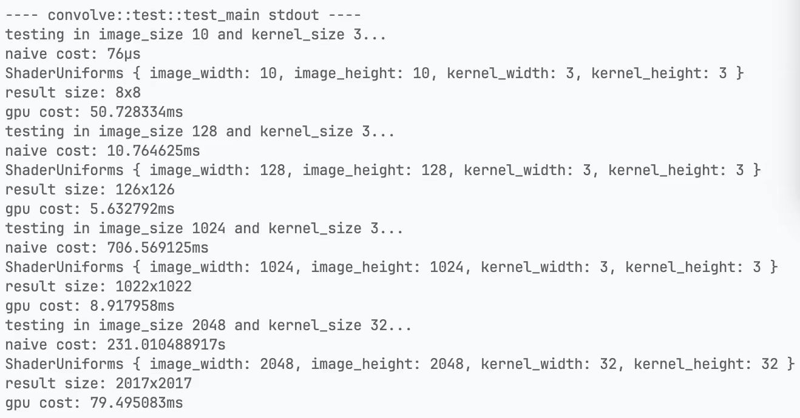
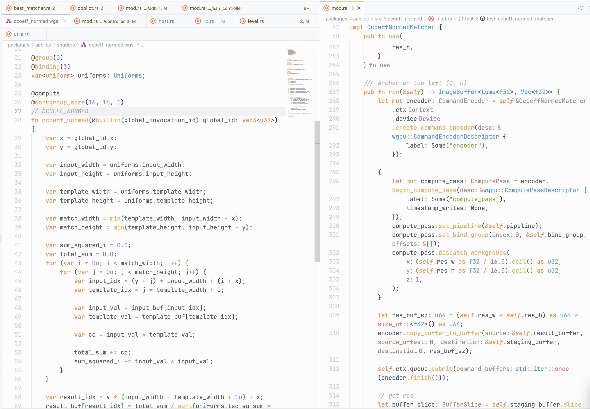
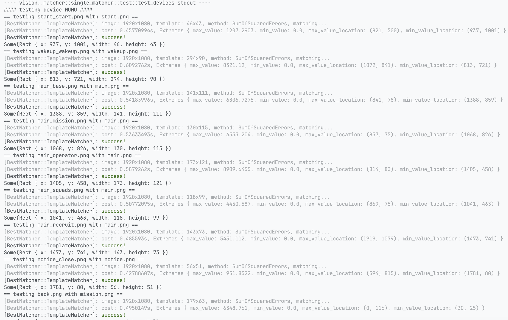
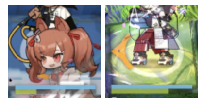
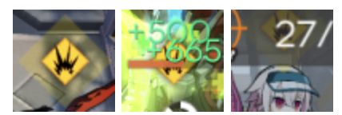
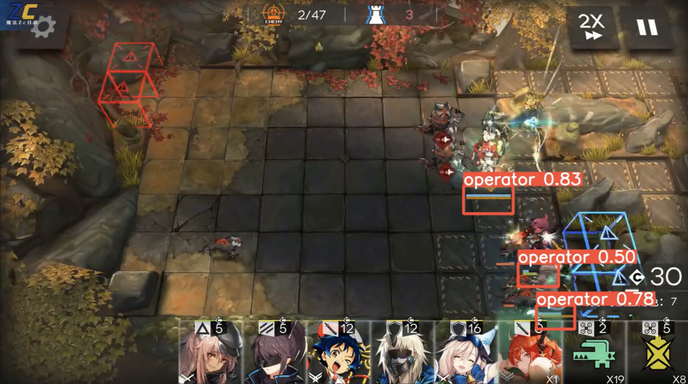

```mermaid
gantt
    title 任务进度
    dateFormat  YYYY-MM-DD
    section 整体项目
    项目											  :2024-06-28, 2024-07-09
    组队立项           								 :a1, 2024-06-28, 1d
    立项汇报           								 :a2, 2024-06-29, 1d
    中期检查                                         :a3, 2024-07-03, 1d
    项目答辩           								 :a4, 2024-07-09, 1d
    section 整体
    准备工作   :prepare, 2024-06-28, 1d
    cv模型    :cv, after prepare, 5d
    改善cv模型 :cvp, after cv, 3d
    操作轴生成 :after cv, 2d
    操作轴执行 :2024-07-03, 2d
    section 模型
    干员技能就绪二分类 :done, 2024-06-28, 1d
    干员方向四分类    :done, 2024-06-28, 2d
    待部署区识别      :crit, 2024-06-29, 2d
    section GUI 程序
    骨架搭建      :2024-06-28, 1d
    接入 aah-core :2024-06-29, 1d
    section 核心
    代码整理及文档注释编写 :2024-06-29, 1d
    关卡数据解析         :2024-06-29, 1d
    地块到像素坐标转换    :2024-06-29, 1d
```

## 概述

### 1. 仓库结构

```mermaid
---
title: 仓库结构
---
flowchart LR

subgraph gui[aah-gui]
	aah-gui["aah-gui(bin)"]:::bin
end

subgraph azur-arknights-helper
    aah-core
    aah-cv
    aah-resource
    aah-cli["aah-cli(bin)"]:::bin
end

subgraph ai[aah-ai]
	aah-ai
	模型
end

classDef lib fill:#f96
classDef bin fill:#f9f
```

- **仓库 aah-ai**：AI 相关
    -  rust crate<mark style="background: #FFF3A3A6;">lib</mark> `aah-ai`：AI 模型封装，基于 onnxruntime 进行推理

- **仓库 aah-gui**：GUI 应用
    -  rust crate<mark style="background: #D2B3FFA6;">bin</mark> `aah-gui`：GUI 应用，使用 Tauri(Solidjs + Rust)

- **仓库 azur-arknights-helper**：核心以及 CLI 应用
    -  Rust crate<mark style="background: #FFF3A3A6;">lib</mark> `aah-core`：核心
    -  Rust crate<mark style="background: #FFF3A3A6;">lib</mark> `aah-cv`：一些使用 Rust 重新实现的 OpenCV 算法
    -  Rust crate<mark style="background: #FFF3A3A6;">lib</mark> `aah-resource`：处理游戏数据相关
    -  Rust crate<mark style="background: #D2B3FFA6;">bin</mark> `aah-cli`：CLI 应用


### 2. 模块关系

```mermaid
---
title: 各模块依赖关系
---
flowchart

aah-gui["aah-gui(bin)"]:::bin
aah-gui --> aah-core

aah-cli["aah-cli(bin)"]:::bin
aah-cli --> aah-core

aah-core
aah-cv
aah-resource

aah-core --> aah-cv
aah-core --> aah-resource
aah-core --> aah-ai

aah-ai

classDef bin fill:#f9f
```

## 核心部分

### 1. 设备控制

基于 Adb 实现触控、截图等设备控制功能。


> 内容来源：[Android 调试桥 (adb)  |  Android Studio  |  Android Developers](https://developer.android.com/tools/adb?hl=zh-cn#screencap)

**优化**：「客户端」与「服务器」之间的通信是基于字符的 TcpStream 的，因此可以通过直接通过 TcpStream 按照服务器协议与其通信来省去进程调用的消耗。

#### 1.1 截图

基于 `adb shell exec-out screencap -p` 命令。

测试：



```
---- adb::test::test_screencap stdout ----
by process cost: 712.14525ms, 2621957
by socket cost: 674.283417ms, 2620505
```

---

**Minicap**


```
ABI=$(adb shell getprop ro.product.cpu.abi | tr -d '\r')
adb push libs/$ABI/minicap /data/local/tmp/
SDK=$(adb shell getprop ro.build.version.sdk | tr -d '\r')
adb push jni/minicap-shared/aosp/libs/android-$SDK/$ABI/minicap.so /data/local/tmp/
adb shell LD_LIBRARY_PATH=/data/local/tmp /data/local/tmp/minicap -P 1080x1920@1080x1920/0 -t
```

**效果**：平均 400ms，127.0.0.1:16384

```
[Minicap]: header: 1920x1080@1920x1080/0 2
[Minicap]: new frame(318405 bytes), decoding...
[Minicap]: updated screen_cache, cost: 398.688958ms
[Minicap]: new frame(33267 bytes), decoding...
[Minicap]: updated screen_cache, cost: 258.00825ms
[Minicap]: new frame(318219 bytes), decoding...
[Minicap]: updated screen_cache, cost: 406.642834ms
[Minicap]: new frame(318253 bytes), decoding...
[Minicap]: updated screen_cache, cost: 404.737125ms
[Minicap]: new frame(318538 bytes), decoding...
[Minicap]: updated screen_cache, cost: 401.83975ms
[Minicap]: new frame(317675 bytes), decoding...
[Minicap]: updated screen_cache, cost: 405.639458ms
[Minicap]: new frame(315526 bytes), decoding...
[Minicap]: updated screen_cache, cost: 403.249541ms
[Minicap]: new frame(315892 bytes), decoding...
[Minicap]: updated screen_cache, cost: 395.771958ms
[Minicap]: new frame(316726 bytes), decoding...
```

**<font color="red">问题</font>**：sdk-32、sdk-31 的 `x86_64` 的 `.so` 文件是 `i386` 的，而仓库作者不太维护了，只能暂时搁置。


#### 1.2 触控

基于 `adb shell input` 命令

#### 1.3 总结

最终封装结果：


### 2. 任务系统

基于 TOML 进行配置，任务之间可以互相引用：

```toml
[Multi]
fail_fast = false
tasks = [
    { ActionClickMatch = { match_task = { type = "Template", template = "start_start.png" }, wrapper = { retry = 1 } } },
    { ActionClickMatch = { match_task = { type = "Template", template = "wakeup_wakeup.png" }, wrapper = { delay = 2, retry = 5 } } },
    # 月卡
    { ActionClickMatch = { match_task = { type = "Template", template = "confirm.png" }, wrapper = { delay = 4, retry = 2 } } },
    { ActionClickMatch = { match_task = { type = "Template", template = "qiandao_close.png" }, wrapper = { delay = 2, retry = 2 } } },
    # 公告
    { ActionClickMatch = { match_task = { type = "Template", template = "notice_close.png" }, wrapper = { delay = 2, retry = 2 } } },
]
```


#### 1.1 任务


内置任务可由 TOML 使用：


### 3. cv 部分

- 使用 Rust 直接在 CPU 上实现

    单核在 2560x1440 的图像中匹配 159x158 的模板：<font color="red">十分钟</font>

    使用 rayon 库多核并行在 2560x1440 的图像中匹配 159x158 的模板：<font color="orange">七分钟</font>

- 使用 wgsl 编写 compute shader 并通过 Rust 的 wgpu 库在 GPU 上运行：

    16x16 workgroup 并行：<font color="green">0.7549291s</font>

- fft

    互相关系数模板匹配其实就是卷积，而这件事可以通过 fft 加速：

    

    最后得出的结果就是，还不如在 GPU 上直接算快。

    fft 虽然把 $O(n^2)$ 优化成了 $O(n\log n)$ 但是还是有极大的消耗。

    之后考虑到每一层的蝶形运算是可以并行做的，于是尝试实现在了 GPU 上的 fft：

    ```
    testing in size 65536...
    naive fft cost: 26.032667ms
    gpu fft cost: 87.053042ms
    ```

    并行大小是有限制的（65536），如果要支持蝶形运算数超过这个数的一层的运算，就要分多次进行运算，而这个就会变得特别复杂。

    于是只尝试了一下 65536 大小的傅立叶变换，发现甚至不如 CPU，其原因是，数据以及指令传输占了大部分时间（70ms 左右）

    所以后面也就没再想 fft 的事了。

最终就是对每一个匹配算法，写一个对应的 shader，在 GPU 上用 16x16 的 workgroup 并行跑。





## 模型部分

### 1. 干员方向四分类



 [MnistSimpleCNN](https://arxiv.org/abs/2008.10400)，输入是 720p 下以格子正中心 96x96 的图片

### 2. 干员技能图标就绪二分类



[Inception v1](https://arxiv.org/abs/1409.4842v1)，输入需要是 720p 下截取的 64x64 的图片

### 3. 干员检测



yolov8n，输入是 16:9 的图片缩放到 640x640

### 4. 场上干员目标检测

基于 yolov8，正在训练，目前效果：

<video src="./assets/yolo.mp4"/>

## 功能演示

### 1. aah-cli


「开始唤醒」任务：

<video src="./assets/start_up.mp4"></video>

「领取任务奖励」任务：

<video src="./assets/award.mp4"></video>

### 2. aah-gui


「前端」进程即展示的界面，「后端」进程负责与操作系统交互，二者之间通过 IPC 来通信。

Electron(Chromium) --> Tauri(WRY)

Electron(Frontend + JS) --> Tauri(Frontend + Rust)

GUI 应用执行任务：

<video src="./assets/gui_award.mp4"/>

GUI 应用展示 Analyzer 分析结果：

<video src="./assets/gui_deploy-analyze.mp4"/>

## 开发记录

- 2024-06-28

    - 讨论项目想法，最终采纳 @肖斌 提出的「明日方舟助手」想法。

    - @肖斌 进行技术选型、创建仓库

        共有三个仓库：

        - `azur-arknights-helper`：@肖斌 之前闲暇时间的产物，整个助手的核心部分

            > 负责人：@肖斌

            整个仓库已有基本的架构及功能，包含基于 Adb 的设备控制器的实现（具备连接、触控、截图等基本功能），还有一些基于模板匹配的简单的自动化操作。

            本仓库为一个 Cargo Workspace，其中有多个 package：

            - `azur-arknights-helper-cli`（根 Package）

                binary crate（可执行程序）：提供了简单的 CLI

            - `packages/aah-core`

                lib crate（库）：包含助手的实例结构、adb、任务、控制器、视觉分析等的逻辑

            - `packages/aah-cv`

                lib crate（库）：包含一些常见 CV 方法的 Rust 实现（如模板匹配）

            - `packages/aah-resource`

                lib crate（库）：包含一些游戏资源处理相关的逻辑（如数据解析、地块对应屏幕像素坐标计算等）

        - `aah-ai`：AI 模型仓库，以及 Rust API

            > 负责人：@杨鹏、@王彦博

            训练：使用 Python 训练，导出为 ONNX 运行时可加载的文件。

            推理：使用 Rust 加载 ONNX 文件进行推理，提供 Rust API。

        - `aah-gui`：图形界面桌面程序仓库

            > 负责人：@唐博文、@田佳文

            基于 Tauri（前端技术 + Rust）

    - 在组内对所用技术及工作流进行了基本的讲解。

    - 尝试、讨论明晰了开发路线。

- 2024-06-29

    - @肖斌 查阅资料分析得到待部署区识别方案

    - `aah-ai`：
        - @王彦博、@杨鹏 完成了基础的几个模型：
            1. 场上干员方向四分类
            2. 场上干员技能就绪而分类
            3. 干员血条的目标检测
        - @杨鹏 对模型进行了对应 Rust 推理逻辑的编写
        - @王彦博 开始训练对待部署区干员的目标检测
        - <font color="blue">@唐博文 完成了 OCR 模型的导出</font>
    - `aah-gui`：
        - @唐博文 完成了基本的展示设备画面的界面（前端）
        - @田佳文 完成了基本的获取图像 api 逻辑（Rust）
        - @田佳文 完成了与 `aah-core` 的基本对接（Rust）
    - `azur-arknights-helper`：
        - @肖斌 完成了代码整理和相关文档注释以供 `aah-gui` 使用
        - @肖斌 完成了对游戏资源中 `levels.json`（关卡数据）的解析
        - @肖斌 完成了「地块坐标」到对应「屏幕像素坐标」的计算实现
    
- 2024-06-30

    - `azur-arknights-helper`：
        - @肖斌 待部署区卡片识别
    
- 2024-07-01

    - `aah-ai`：
        - @杨鹏 基于进程运行命令完成 OCR 的封装
        - @王彦博 继续炼丹
    - `aah-gui`：
    - `azur-arknights-helper`：
        - @肖斌 完成对 OpenCV 中 CCOEFF_NORMED 模板匹配方法的 rust wgpu 加速实现（但是和 OpenCV 不是很一致）
        - @肖斌 引入 minicap，优化截图速度

- 2024-07-02

    - `aah-ai`:
        - <font color="blue">@肖斌 示范 PaddleOCR onnx 推理代码阅读</font>
        - @杨鹏、<font color="blue">@唐博文</font> 阅读 PaddleOCR onnx 推理脚本
        - @王彦博 生成场上干员数据集（10个干员，单个关卡，固定位置，4个方向），并训练，效果还可以。对于遮挡处理不够好
        - <font color="blue">@田佳文 制作场上干员数据集</font>
    - `azur-arknights-helper`：
    - `aah-gui`：
        - <font color="blue">@肖斌 重构界面</font>


---

